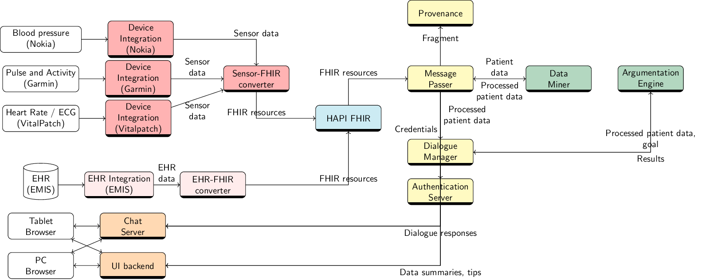

# EHR-FHIR Converter

Convert data from arbitrary EHR vendors to the FHIR standard.

Operates as part of the [CONSULT architecture](https://dl.acm.org/doi/pdf/10.5555/3306127.3332107?download=true) (_ehr-fhir-converter_), a collaborative mobile decision-support system to help patients suffering from chronic diseases with multiple morbidities self-manage their treatment:



Cite as _[A semi-autonomous approach to connecting proprietary EHR standards to FHIR](https://arxiv.org/pdf/1911.12254.pdf). Chapman, Martin and Curcin, Vasa and Sklar, Elizabeth I. 2019._

## Getting Started

These instructions will get you a copy of the project up and running on your local machine for development and testing purposes. See deployment for notes on how to deploy the project on a live system.

### Prerequisites

Before installing, [download and install Python 3](https://www.python.org/download/releases/3.7) and [Pip](https://pip.pypa.io/en/stable/installing/), a Python package manager.

(Recommended) Then install [virtualenv](https://virtualenv.pypa.io/en/stable/installation/).

### Other service communication

Receives messages from: ehr-integration ([install](https://github.kcl.ac.uk/consult/ehr-integration/blob/master/README.md)).
Sends messages to: fhir-server ([install](https://github.com/kclconsult/hapi-fhir-jpaserver-starter/blob/master/README.md)).

## Running

Clone this repository:

```
git clone git@github.com:kclconsult/ehr-fhir-converter.git
```

Change into the directory:

```
cd ehr-fhir-converter/src
```

Initialise a virtual environment, and activate:

```
virtualenv -p python3 env
. env/bin/activate
```

Install dependencies:

```
pip install -r requirements.txt
```

##### (Optional, Option 1) Build FHIR classes

Clone the FHIR parser repository:

```
git clone git@github.com:smart-on-fhir/fhir-parser.git src/main/python/fhir-parser
```

Copy configuration scripts into the directory:

```
cp src/main/python/mappings.py src/main/python/fhir-parser/
cp src/main/python/settings.py src/main/python/fhir-parser/
```

Install parser requirements:

```
cd src/main/python/fhir-parser/
pip install -r requirements.txt
```

Generate FHIR Python classes:

```
touch Default/__init__.py
python generate.py
```

Move generated classes into project:

```
cd ../
mv models/ models_full/
touch models_full/__init__.py
```

Automated through `fhir-parser.sh`.

##### (Optional, Option 2) Download FHIR classes

Clone the FHIR client repository.

```
git clone git@github.com:smart-on-fhir/client-py.git src/main/python/client-py
```

Copy FHIR classes into project:

```
cd src/main/python/
cp -r client-py/fhirclient/models/ models_full/
```

## Usage

Run as follows:

```
python listen.py
```

The app runs by default on port 3004.

## Install as package

Run setup tools from the root directory:

```
python setup.py sdist bdist_wheel
```

Given a certain release, either available in ``dist/`` if built, or via Github, install as follows:

```
python setup.py install
```

## Documentation

[View](https://kclconsult.github.io/ehr-fhir-converter).

## Running the tests

```
python setup.py test
```

## Deployment

Deployment is via [Docker](https://docs.docker.com/compose/install/), and includes containers for this application and an optional message queue.

Specify the address of the FHIR server and credentials in [docker-compose](docker-compose.yml). If a hostname, reference its corresponding certificate. Also specify the address of the hostname if unlikely to be present in the DNS.

Build these containers:

```
docker-compose build
```

Run these containers:

```
docker-compose up -d
```

(Optional) Run without queue:

```
docker-compose up --scale webapp-queue=0 rabbit=0
```

Different docker-compose files exist to accomodate different service configurations.

## Built With

* [NLTK](https://www.nltk.org/)

## Contributing

Please read [CONTRIBUTING.md](CONTRIBUTING.md) for details on our code of conduct, and the process for submitting pull requests to us.

## Versioning

We use [SemVer](http://semver.org/) for versioning. For the versions available, see the [tags on this repository](https://github.com/martinchapman/nokia-health/tags).

## Authors

Produced as part of the [CONSULT](https://consult.kcl.ac.uk/) project.


## License

This project is licensed under the MIT License - see the [LICENSE.md](LICENSE.md) file for details.
